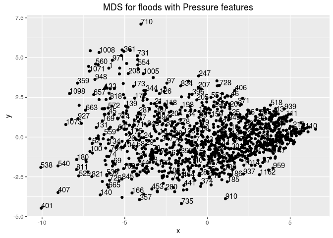
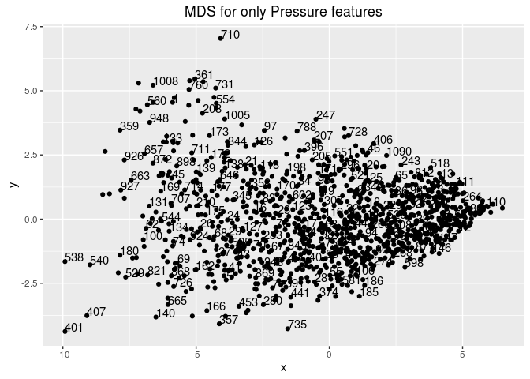
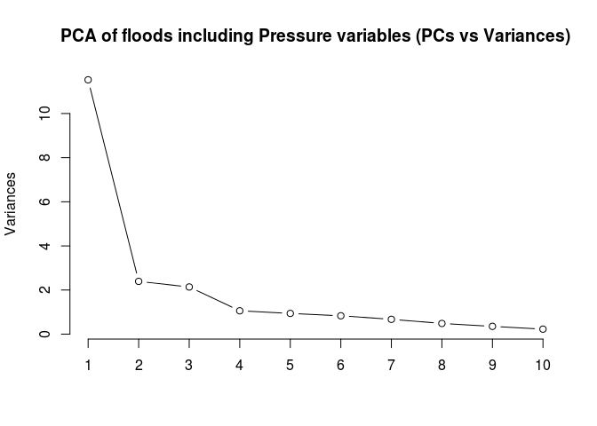

# Flood effect analysis in relation with Pressure
March 7, 2016  

In this section, we intend to find the relation between floods, their after-effects (such as damaged area, dead, magnitude etc), and the pressure. Before going into the experiment details, we will introduce our way of collecting pressure data and our intuition behind opting for these metrics. 


 Although natural factors such as precipitation, soil erotion, and mishandling of large dams are the main culprit for floods, we want to understand the pressure patterns and their impact on the after effects of the flood. We believe the pressure at a certain day or at a certain time will not have as adverse affect as a flood. To that extent, we decided to divide the pressure data based on 2 types of intervals. 
 
 * Intervals based on days 
 * Intervals based on distance.
 
 *Intervals based on days* look at a fixed interval of 5, 10 , and 15 days before the start of the flood and the otehr interval being the duration of the flood whereas *Intervals based on distance* looks at the area around the starting point of the flood. We ignore the presence of any other water bodies surrounding the starting point due to the unavaiability of the information. We took the *mean* and *standard deviation* of pressure across these intervals. These intervals give us 16 pressure points for each flood. 
 
 Among the attributes of a flood, we consider these:
 
 * Affected.Square. Kilometers
 * Magnitude of the flood
 * Number of persons displaced
 * Severity of the flood
 * Duration of the flood 
 * Casualities due to the flood. 
 
 We normalized all the data points (including the pressure values) for each flood and we replaced the missing points using the *mean* value. We first look at different statistics pertaining to the flood data alone after which we include the pressure data for analysis. We find the interval and the pressure value which has high correlation with each of the flood statistics as well as we extract principal components to further analyse. 
 
 In the following R code, we have the data cleaning and pre-processing for the required functions at the later point. Also, we have the functions to extract the intervals discussed above for each flood data. 
 


We have got all the data that we require for further analysis. In a nut shell, we got the pressure points as described above, created new datasets including these pressure points. Normalized all the data so that the scale of the data becomes irrelavant for the analysis. From here, we concentrate on extracting the analysis. 
We first start our analysis by analyzing how the *MDS* plots look when we reduce the data to 2 dimensions. 

<!-- --><!-- -->

We can see how the flood data varied with adding the pressure points. We can see that pressure data scatters the flood data, implying that we have some interaction effect between floods and pressure data. We will revisit the effect of pressure on the floods when we do the PCA and cluster analysis. 

An interesting observation here is the MDS of only the data related to pressure. We can see that the effect of the other flood factors is exactly negated and pressure dominated the distances in MDS. It would be interesting to realize the effects of pressure later in the next analysis. 

<!-- -->

We now move to perform PCA on these two different datasets and see how the principal components vary by adding the pressure data. 

<!-- --><!-- -->

We can see that adding pressure alters the principal components too. Lets also present the results of clustering. 


<!-- --><!-- -->

Adding pressure for clustering alters the clusters. The differences in clusters are also visible when we draw a dendogram of clusters performed using hierarchical clustering. We also performed Model based clustering using *mclut* and observed that the number of clusters formed by adding pressure (10) vary greatly from the clusters formed without adding pressure(4). 

In the next segment, we compare the correlation between PCA's of floods and pressure data to get an understanding of the important attributes.


```r
p.pca <- prcomp(onlyPressure,center=TRUE,scale=TRUE)
pca_P <- predict(p.pca,onlyPressure)
corr <- rcorr(as.matrix(newFrame_withP))
pcaAnalysisd_1 <- data.frame(pca_withoutP[,1],onlyPressure)
corr_1 <- rcorr(as.matrix(pcaAnalysisd_1))
pcaAnalysis_1 <- data.frame(newFrame_withoutP,pca_P[,1])
corr_1 <- rcorr(as.matrix(pcaAnalysis_1))
```

From PCA analysis, we found that the co-relation is very high between the variables of the floods. So we did PCA to reduce the dimensions to 1 or 2 for floods, which can help us identify the relation with the pressure across various intervals. We couldn't find a compelling correlation with any of the pressure points but we found that on average, standard deviation related pressure points had more influence on the flood parameters when compared with the average value, thereby confirming that changes in the pressure has more effect on the actual amount of pressure. 
