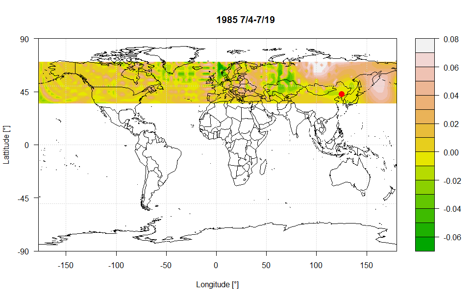
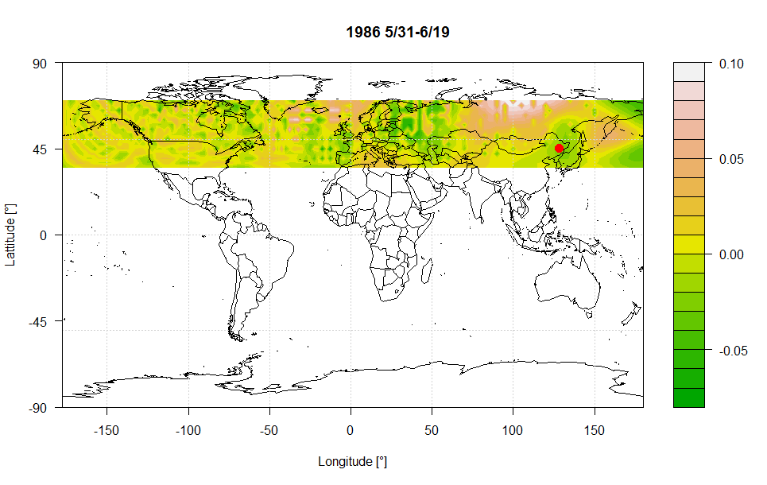
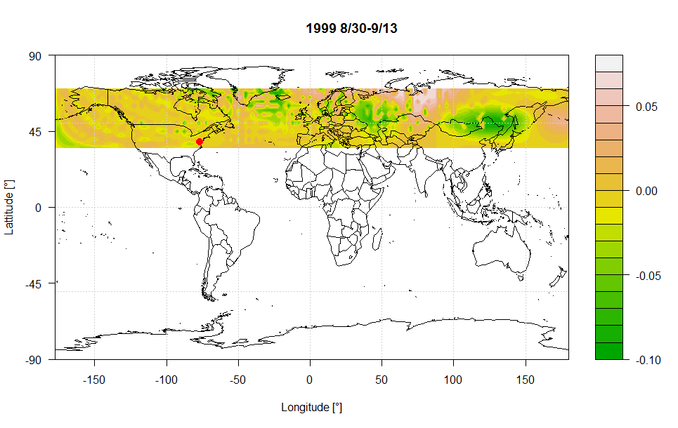

I used the pressure data for 15 days before floods, and extract the first component:

 
 
 
 
 
 
 It seems there is a pattern in pressure before floods: the low pressure air is surrounded by the high pressure air.

