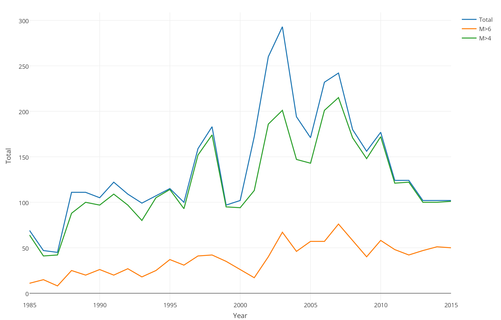

```{r setup, include=FALSE}
knitr::opts_chunk$set(echo = TRUE)
```

### Data Set
* Gridded Geopotential height data
* Flood record data from Dartmouth Flood Observatory 

#### Trending

The flood reocrd data from 1985 to 2015, shows the overall floors events was increasing and reaching peak at 2006, 2007, then started decreasing, however the severe floods (M>6) did not in a decreasing trend.


<br/>



<br/>

I will continue with PCA
