```{r setup, include=FALSE}
knitr::opts_chunk$set(echo = TRUE)
```

### Data Set
* Gridded Geopotential height data ( Longitude: -7.5 to 7.5, Latitude: 40 to 55)
* Flood record data from Dartmouth Flood Observatory (France only)

#### Trending

The flood reocrd data for France from 1990 to 2015, shows the overall floors events was increasing and reaching peak at 2006, 2007, then started decreasing, however the severe floods (M>6) did not in a decreasing trend.


<br/>

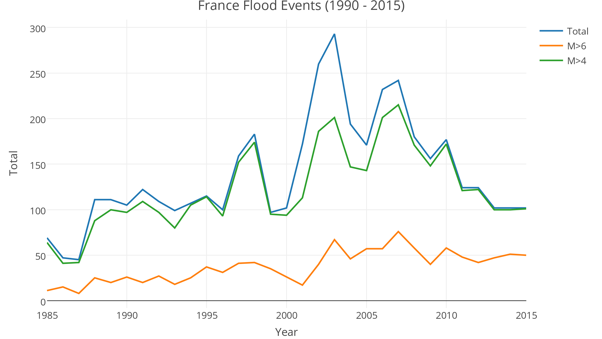

<br/>

#### Analysis

Ran the PCA for Gridded Geopotential height data on yearly basis.

Step 1: extract France data out of the big data set, save it to a new 3-D matrix (7x7x9496). The longitude is from 7.5W to 7.5E, the latitude is from 40N to 55N, so every day there will be 49 data points, we have totally 9496 days' data.

Step 2: transform the 3-D matrix (7x7x9496) to a new 2-D matrix (9496*49), every row will contain one day's 49 data points.

Step 3: run PCA on this 2-D matrix.

Step 4: transform the PCA component (1x49) back to 2-D matrix (7x7) using the same order step 2 used

After running these steps for 1990 - 2015, here are the first PCA component.

<table>
<tr><td>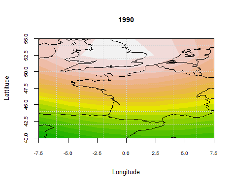</td><td>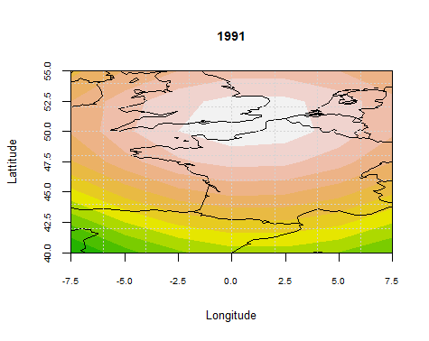</td></tr>
<tr><td>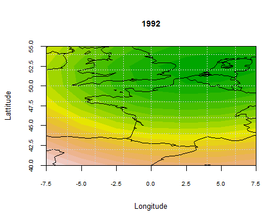</td><td>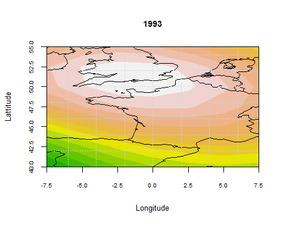</td></tr>
<tr><td>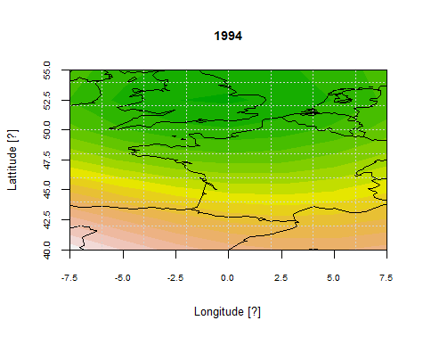</td><td>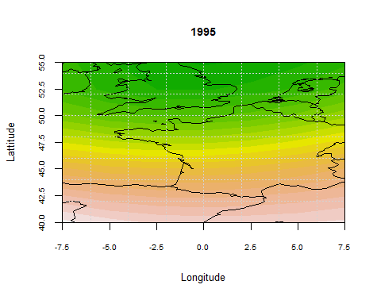</td></tr>
<tr><td>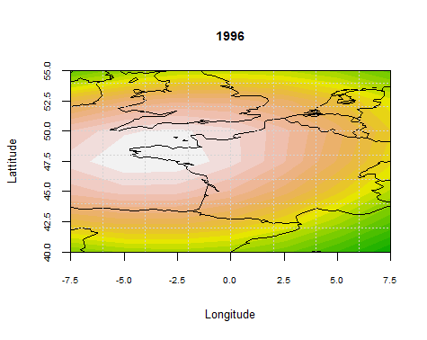</td><td>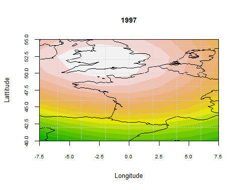</td></tr>
<tr><td>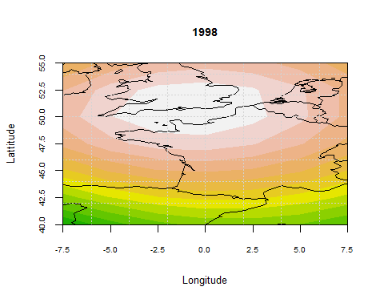</td><td>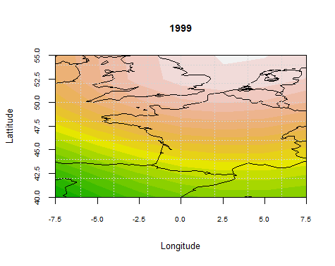</td></tr>
<tr><td>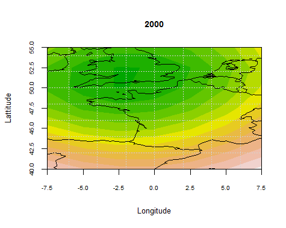</td><td>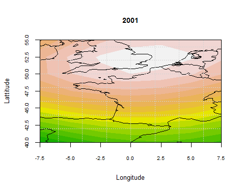</td></tr>
<tr><td>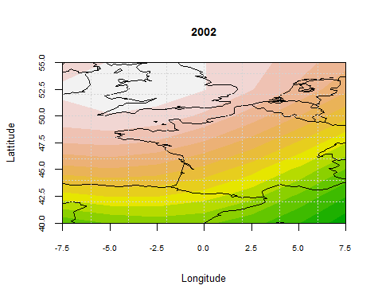</td><td>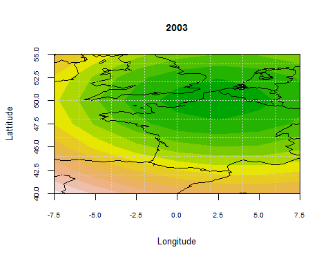</td></tr>
<tr><td>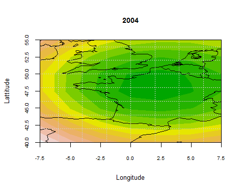</td><td>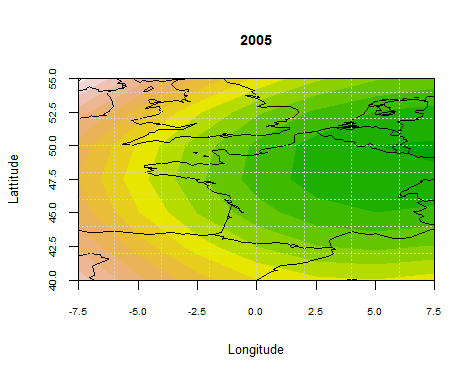</td></tr>
<tr><td>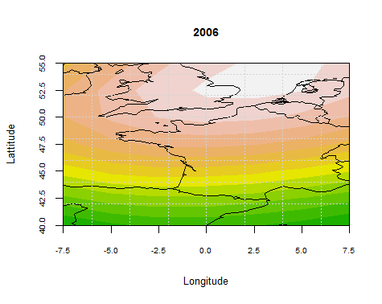</td><td>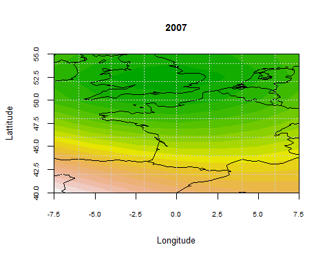</td></tr>
<tr><td>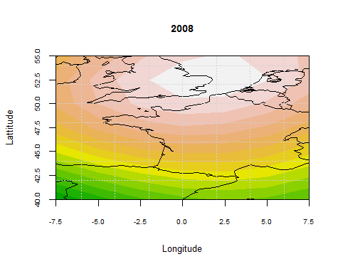</td><td>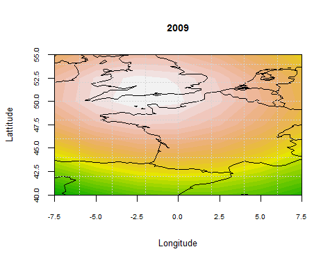</td></tr>
<tr><td>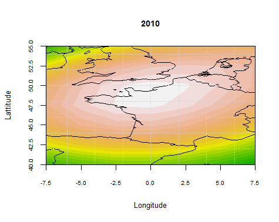</td><td>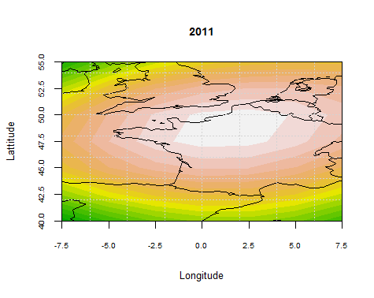</td></tr>
<tr><td>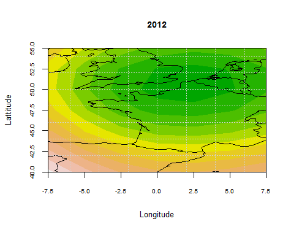</td><td>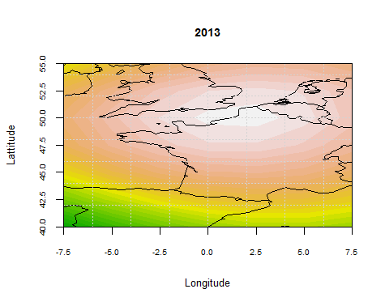</td></tr>
<tr><td>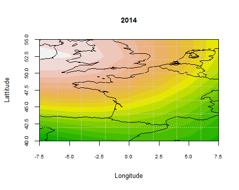</td><td>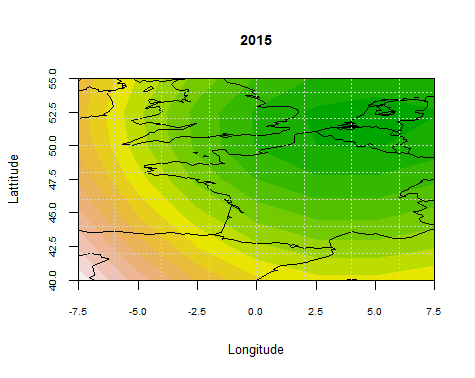</td></tr>
</table>


