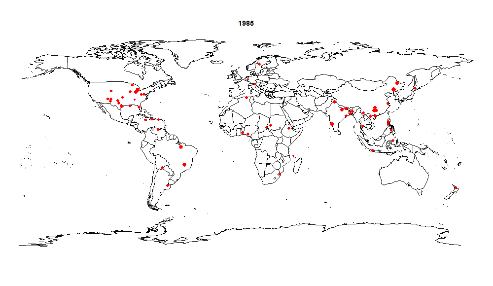

```{r setup, include=FALSE}
knitr::opts_chunk$set(echo = TRUE)
```

### Data Set
* Gridded Geopotential height data ( Longitude: -7.5 to 7.5, Latitude: 40 to 55)
* Flood record data from Dartmouth Flood Observatory (France only)

#### Trending
Below is the flood events of the world from 1985 to 2015.


<br/>

The flood reocrd data for France from 1990 to 2015, shows the overall floors events was increasing and reaching peak at 2006, 2007, then started decreasing, however the severe floods (M>6) did not in a decreasing trend.


```{r echo=FALSE}
load('floods.RData')

floods$date.began.year <- format(floods$date.began, "%Y")

flood_count_by_year <- data.frame(table(floods$date.began.year))
names(flood_count_by_year) <- c('year','count')
library(ggplot2)


ggplot(data=flood_count_by_year,
       aes(year, count, group=1)) +
       geom_line() + 
      labs(x = "Year", y = "Number of floods", 
              title = "Global flood count per year") + theme_bw()
```

```{r echo=FALSE}
library(reshape)

floods.m.4 <- cast(floods, date.began.year ~ m.4, fun.aggregate=length, value='register')
floods.m.4['percent'] <- floods.m.4['1'] / (floods.m.4['1'] + floods.m.4['0'])

ggplot(data=floods.m.4,
       aes(x=date.began.year, y=percent, group=1)) +
       geom_line() + 
        labs(x = "Year", y = "Percent of floods", 
              title = "Percent of floods M>4") + theme_bw()

```


```{r echo=FALSE}

floods['count'] <- 1
floods_by_cause <- xtabs(count ~ main.cause, data=floods)
floods_by_cause <- sort(floods_by_cause, decreasing=TRUE)
top.causes <- names(floods_by_cause)[1:5]

other.count <- sum(floods_by_cause) - sum(floods_by_cause[top.causes])
floods_by_cause <- floods_by_cause[top.causes]
floods_by_cause['other'] <- other.count

barplot(floods_by_cause, las=1, main='Flood count by main cause', cex.names=.7, horiz=TRUE, xlab='Flood count')
```

```{r echo=FALSE}

# Floods by magnitude
hist(floods$magnitude)

hist(log(floods$affected.sq.km))
```


<br/>

#### Analysis

Now let's run the PCA for Gridded Geopotential height data on yearly basis.

Step 1: extract France data out of the big data set, save it to a new 3-D matrix (7x7x9496). The longitude is from 7.5W to 7.5E, the latitude is from 40N to 55N, so every day there will be 49 data points, we have totally 9496 days' data.

Step 2: transform the 3-D matrix (7x7x9496) to a new 2-D matrix (9496*49), every row will contain one day's 49 data points.

Step 3: run PCA on this 2-D matrix.

Step 4: transform the PCA component (1x49) back to 2-D matrix (7x7) using the same order step 2 used

After running these steps for 1990 - 2015, here are the first PCA component for these years.

<table>
<tr><td></td><td></td></tr>
<tr><td></td><td></td></tr>
<tr><td></td><td></td></tr>
<tr><td></td><td></td></tr>
<tr><td></td><td></td></tr>
<tr><td></td><td></td></tr>
<tr><td></td><td></td></tr>
<tr><td></td><td></td></tr>
<tr><td></td><td></td></tr>
<tr><td></td><td></td></tr>
<tr><td></td><td></td></tr>
<tr><td></td><td></td></tr>
<tr><td></td><td></td></tr>
</table>


